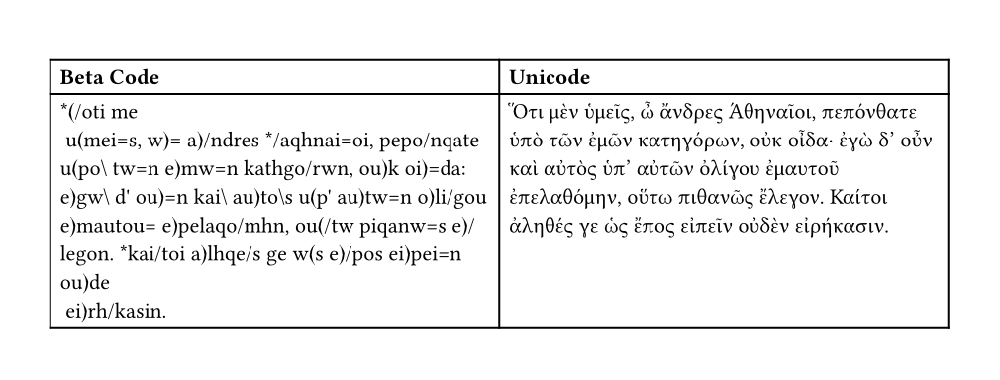

# Betacode

Convert Greek [Beta Code](https://en.wikipedia.org/wiki/Beta_Code) to Unicode with [Typst](https://github.com/typst/typst).

## Example



Typst code for this example:

```typst
#import "@preview/betacode:0.1.0"

#let apology = "*(/oti me\n u(mei=s, w)= a)/ndres */aqhnai=oi, pepo/nqate u(po\ tw=n e)mw=n kathgo/rwn, ou)k oi)=da: e)gw\ d' ou)=n kai\ au)to\s u(p' au)tw=n o)li/gou e)mautou= e)pelaqo/mhn, ou(/tw piqanw=s e)/legon. *kai/toi a)lhqe/s ge w(s e)/pos ei)pei=n ou)de\n ei)rh/kasin."

#table(columns: 2,
  [*Beta Code*], [*Unicode*],
  text(apology), betacode.betacode(apology)
)
```

## Usage
Import this library with
```typst
#import "@preview/betacode:0.1.0"
```

Then use it like this:
```typst
#betacode.betacode("*(/o")
```
